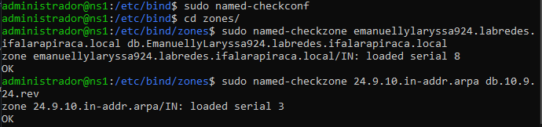
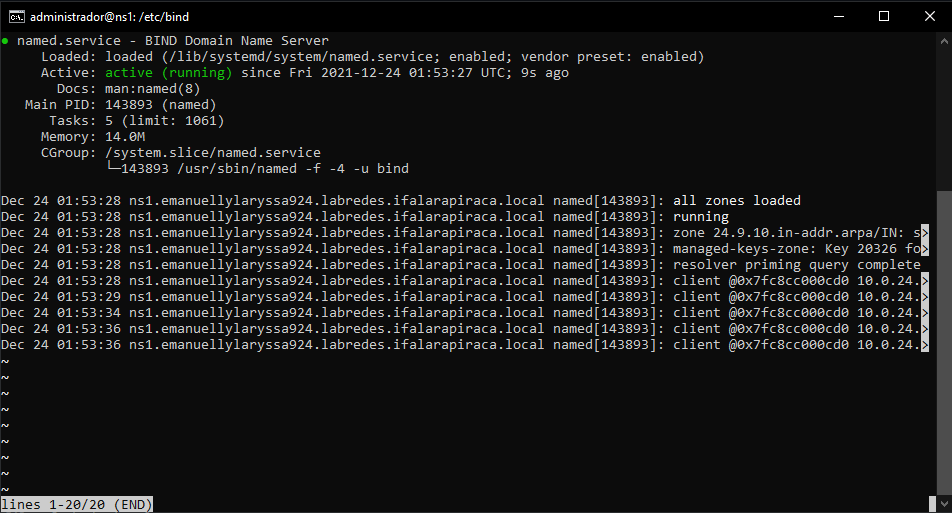

# Implementação DNS Master

## Objetivo: 

    * Instalação e configuração do servidor DNS master com o Bind9
    


 * Definir um nome para a máquina virtual como "ns1.nomedaequipeturma.labredes.ifalarapiraca.local"

```bash 
$ sudo hostnamectl set-hostname ns1.emanuellylaryssa924.labredes.ifalarapiraca.local
$ sudo reboot
```
OBS: os servidos Samba e DNS Master foram instaladas na mesma vm. Assim, o nome que, na instalação do Samba, era "samba.emanuellylaryssa924.labredes.ifalarapiraca.local" passou, na instalação do DNS Master, a ser "ns1.emanuellylaryssa924.labredes.ifalarapiraca.local" agora.

## Instalação do DNS
    
* Instalar o bind9 via apt-get  

```bash
$ sudo apt-get install bind9 dnsutils bind9-doc 
```

```Reading package lists... Done
Building dependency tree
Reading state information... Done
Suggested packages:
  bind-doc resolvconf
The following NEW packages will be installed:
  bind9 bind9-doc dnsutils
0 upgraded, 3 newly installed, 0 to remove and 0 not upgraded.
Need to get 0 B/3353 kB of archives.
After this operation, 6817 kB of additional disk space will be used.
Selecting previously unselected package bind9.
(Reading database ... 113120 files and directories currently installed.)
Preparing to unpack .../bind9_1%3a9.16.6-3ubuntu1.2_amd64.deb ...
Unpacking bind9 (1:9.16.6-3ubuntu1.2) ...
Selecting previously unselected package bind9-doc.
Preparing to unpack .../bind9-doc_1%3a9.16.6-3ubuntu1.2_all.deb ...
Unpacking bind9-doc (1:9.16.6-3ubuntu1.2) ...
Selecting previously unselected package dnsutils.
Preparing to unpack .../dnsutils_1%3a9.16.6-3ubuntu1.2_all.deb ...
Unpacking dnsutils (1:9.16.6-3ubuntu1.2) ...
Setting up bind9-doc (1:9.16.6-3ubuntu1.2) ...
Setting up dnsutils (1:9.16.6-3ubuntu1.2) ...
Setting up bind9 (1:9.16.6-3ubuntu1.2) ...
Adding group `bind' (GID 119) ...
Done.
Adding system user `bind' (UID 113) ...
Adding new user `bind' (UID 113) with group `bind' ...
Not creating home directory `/var/cache/bind'.
wrote key file "/etc/bind/rndc.key"
named-resolvconf.service is a disabled or a static unit, not starting it.
Created symlink /etc/systemd/system/bind9.service → /lib/systemd/system/na                                                                                              med.service.
Created symlink /etc/systemd/system/multi-user.target.wants/named.service                                                                                               → /lib/systemd/system/named.service.
Processing triggers for systemd (246.6-1ubuntu1.7) ...
Processing triggers for man-db (2.9.3-2) ...
Processing triggers for ufw (0.36-7) ...

```

* Verificar o status do serviço para saber se o servidor DNS está rodando como deve.

```bash
$ sudo systemctl status bind9
```

```bash
 named.service - BIND Domain Name Server
     Loaded: loaded (/lib/systemd/system/named.service; enabled; vendor preset: enabled)
     Active: `active` (running) since Tue 2021-12-21 00:02:24 UTC; 21h ago
       Docs: man:named(8)
   Main PID: 40990 (named)
      Tasks: 5 (limit: 1061)
     Memory: 22.7M
     CGroup: /system.slice/named.service
             └─40990 /usr/sbin/named -f -4 -u bind

Dec 21 21:10:06 ns1.emanuellylaryssa924.labredes.ifalarapiraca.local named[40990]: client @0x7fa2a0014580 10.0.24.3#65174 (wpad.meuintelbras.local): query (cache) 'wpad.>
Dec 21 21:10:08 ns1.emanuellylaryssa924.labredes.ifalarapiraca.local named[40990]: client @0x7fa2a0014580 10.0.24.3#61737 (signaler-pa.clients6.google.com): query (cache>
Dec 21 21:10:09 ns1.emanuellylaryssa924.labredes.ifalarapiraca.local named[40990]: client @0x7fa2a0014580 10.0.24.3#53810 (www.youtube.com): query (cache) 'www.youtube.c>
Dec 21 21:10:14 ns1.emanuellylaryssa924.labredes.ifalarapiraca.local named[40990]: client @0x7fa2a0014580 10.0.24.3#59974 (wpad.meuintelbras.local): query (cache) 'wpad.>
Dec 21 21:10:22 ns1.emanuellylaryssa924.labredes.ifalarapiraca.local named[40990]: client @0x7fa2a0014580 10.0.24.3#58316 (sadownload.mcafee.com): query (cache) 'sadownl>
Dec 21 21:10:24 ns1.emanuellylaryssa924.labredes.ifalarapiraca.local named[40990]: client @0x7fa2a0014580 10.0.24.3#60603 (download.mcafee.com): query (cache) 'download.>
Dec 21 21:10:26 ns1.emanuellylaryssa924.labredes.ifalarapiraca.local named[40990]: client @0x7fa2a0014580 10.0.24.3#65048 (ssl.gstatic.com): query (cache) 'ssl.gstatic.c>
Dec 21 21:10:49 ns1.emanuellylaryssa924.labredes.ifalarapiraca.local named[40990]: client @0x7fa2a0014580 10.0.24.3#52838 (api.twitter.com): query (cache) 'api.twitter.c>
Dec 21 21:10:52 ns1.emanuellylaryssa924.labredes.ifalarapiraca.local named[40990]: client @0x7fa2a0014580 10.0.24.3#60026 (play.google.com): query (cache) 'play.google.c>
Dec 21 21:10:54 ns1.emanuellylaryssa924.labredes.ifalarapiraca.local named[40990]: client @0x7fa2a0014580 10.0.24.3#50514 (static.meliuz.com.br): query (cache) 'static.m>
```
OBS: é possível perceber que o DNS está rodando ao verificar a palavra "active" em destaque


* Em caso de não rodar é preciso ativar o DNS.

```bash
$ sudo systemctl `enable` bind9
```

## A pasta bind

* Será preciso adicionar alguns arquivos à pasta bind para realizar a configuração do DNS Master. 

```
Realizar a checagem dos arquivos e permissões da pasta bind
```

```bash
`$ ls /etc/bind`

bind.keys  db.255    named.conf                named.conf.options
db.0       db.empty  named.conf.default-zones  rndc.key
db.127     db.local  named.conf.local          zones.rfc1918
```

```bash
`$ ls -la /etc/bind`

total 56
drwxr-sr-x  2 root bind 4096 Dec 19 18:42 .
drwxr-xr-x 98 root root 4096 Dec 19 18:42 ..
-rw-r--r--  1 root root 1991 Apr 27  2021 bind.keys
-rw-r--r--  1 root root  237 Sep 15  2020 db.0
-rw-r--r--  1 root root  271 Sep 15  2020 db.127
-rw-r--r--  1 root root  237 Sep 15  2020 db.255
-rw-r--r--  1 root root  353 Sep 15  2020 db.empty
-rw-r--r--  1 root root  270 Sep 15  2020 db.local
-rw-r--r--  1 root bind  463 Sep 15  2020 named.conf
-rw-r--r--  1 root bind  498 Sep 15  2020 named.conf.default-zones
-rw-r--r--  1 root bind  165 Sep 15  2020 named.conf.local
-rw-r--r--  1 root bind  846 Sep 15  2020 named.conf.options
-rw-r-----  1 bind bind  100 Dec 19 18:42 rndc.key
-rw-r--r--  1 root root 1317 Sep 15  2020 zones.rfc1918
```

### Zonas

* As zonas são extremamente importantes para o funcionamento do servidor DNS e são especificadas em arquivos db. Além disso, elas se dividem em "zona direta" e "zona reversa". Portanto serão criados dois arquivos db, uma para a zona direta e outro para a zona reversa e, assim, ser possível adicionar informações, como o domínio da rede e os ips.


* Os arquivos db são bancos de dados usados quando não se tem conhecimento do ip mas tem o nome da máquina. Cada zona tem o seu próprio arquivo db e, por esse motivo, a zona direta terá um e a reversa outra. 

```
Criar um diretório para armazenar os arquivos de zonas
```

```bash
$ sudo mkdir /etc/bind/zones
```

```bash
`$ cd /etc/bind/
$ ls -la`
total 60
drwxr-sr-x  3 root bind 4096 Dec 19 18:48 .
drwxr-xr-x 98 root root 4096 Dec 19 18:42 ..
-rw-r--r--  1 root root 1991 Apr 27  2021 bind.keys
-rw-r--r--  1 root root  237 Sep 15  2020 db.0
-rw-r--r--  1 root root  271 Sep 15  2020 db.127
-rw-r--r--  1 root root  237 Sep 15  2020 db.255
-rw-r--r--  1 root root  353 Sep 15  2020 db.empty
-rw-r--r--  1 root root  270 Sep 15  2020 db.local
-rw-r--r--  1 root bind  463 Sep 15  2020 named.conf
-rw-r--r--  1 root bind  498 Sep 15  2020 named.conf.default-zones
-rw-r--r--  1 root bind  165 Sep 15  2020 named.conf.local
-rw-r--r--  1 root bind  846 Sep 15  2020 named.conf.options
-rw-r-----  1 bind bind  100 Dec 19 18:42 rndc.key
drwxr-sr-x  2 root bind 4096 Dec 19 18:48 `zones`
-rw-r--r--  1 root root 1317 Sep 15  2020 zones.rfc1918
```

```bash
$ cd /etc/bind/zones/
$ ls -la

drwxr-sr-x 2 root bind 4096 Dec 19 18:48 .
drwxr-sr-x 3 root bind 4096 Dec 19 18:48 

```
OBS: é possível verificar que já foi adicionado o diretório, mas, ao entrar nele, percebe-se que ainda não há arquivo db. Portanto, o próximo passo é criar.

#### Zona direta

```
* Após a criação do diretório, criar um arquivo db no diretório /etc/bind/zones a partir de uma cópia do arquivo /etc/bind/db.empty
``` 

```bash 
$cd /etc/bind/zones
$ sudo cp /etc/bind/db.empty /etc/bind/zones/db.labredes.ifalarapiraca.local 
$ ls -la
```

```
total 12
drwxr-sr-x 2 root bind 4096 Dec 19 18:57 .
drwxr-sr-x 3 root bind 4096 Dec 19 18:48 ..
-rw-r--r-- 1 root bind  353 Dec 19 18:57 db.labredes.ifalarapiraca.local
```
OBS: Veja que agora existe um arquivo db com o domínio labredes.ifalarapiraca.local, mas é preciso mudar o domínio para EmanuellyLaryssa924.labredes.ifalarapiraca.local. Assim é preciso digitar o seguinte comando: 

```bash
$ sudo mv db.labredes.ifalarapiraca.local db.EmanuellyLaryssa924.labredes.ifalarapiraca.local  
```
Verificar: 

```bash
$ ls -la
drwxr-sr-x 2 root bind 4096 Dec 19 19:15 .
drwxr-sr-x 3 root bind 4096 Dec 19 18:48 ..
-rw-r--r-- 1 root bind  704 Dec 19 19:15 db.EmanuellyLaryssa924.labredes.ifalarapiraca.local
```

* Agora chegou o momento de adicionar as informações no arquivo: ips e domínios definidos nas tabelas.

```bash
$ sudo nano db.EmanuellyLaryssa924.labredes.ifalarapiraca.local
```

```
; BIND reverse data file for empty rfc1918 zone
;
; DO NOT EDIT THIS FILE - it is used for multiple zones.
; Instead, copy it, edit named.conf, and use that copy.
;
$TTL    86400
@       IN      SOA     ns1.emanuellylaryssa924.labredes.ifalarapiraca.local. root.emanuellylaryssa924.labredes.ifalar>                             
 			      8         ; Serial
                         604800         ; Refresh
                          86400         ; Retry
                        2419200         ; Expire
                          86400 )       ; Negative Cache TTL
; nameservers
@       IN      NS      ns1.emanuellylaryssa924.labredes.ifalarapiraca.local.
; hosts
ns1.emanuellylaryssa924.labredes.ifalarapiraca.local.     IN    A       10.9.24.112
vm2.emanuellylaryssa924.labredes.ifalarapiraca.local.     IN    A       10.9.24.106
gw.emanuellylaryssa924.labredes.ifalarapiraca.local.      IN    A       10.9.24.1
vm1    CNAME     ns1                 ; CNAME é um apelido
samba  CNAME     ns1                 ; CNAME é um apelido
```
OBS: a cada nova alteração o serial aumenta em 1. Assim, o serial 8 indica que foram feitas 8 alterações. Em caso de não somar +1 ao serial o dns pode não funcionar corretamente. Além disso, o que está após ; é comentário. Vale lembrar que domínio não pode conter letras maiúsculas, espaços e/ou algum tipo de caracter especial, como "-" e "_".

* Na pasta bind restartar e verificar o status

```bash
$ sudo systemctl restart bind9
$ sudo systemctl status bind9
```

#### Zona reversa

* Fazer o mesmo processo de criação do arquivo e adição de informações. Todavia, a cloangem para a zona reversa será a partir de db.12.

```bash 
$ sudo cp /etc/bind/db.127 /etc/bind/zones/db.10.9.24.rev
```

* Adicionar os ips e domínios definidos nas tabelas no arquivo db.10.9.24.rev.

```bash
$ cd /etc/bind/zones/
$ sudo nano db.10.9.24.rev
```
```
; BIND reverse data file for local loopback interface
;
$TTL    604800
@       IN      SOA     emanuellylaryssa924.labredes.ifalarapiraca.local. root.emanuellylaryssa924.lab>                             
                              3         ; Serial
                         604800         ; Refresh
                          86400         ; Retry
                        2419200         ; Expire
                         604800 )       ; Negative Cache TTL
; name servers
@      IN      NS      ns1.emanuellylaryssa924.labredes.ifalarapiraca.local.

; PTR Records
112  IN      PTR     ns1.emanuellylaryssa924.labredes.ifalarapiraca.local.              ; 10.9.24.112
106  IN      PTR     vm2.emanuellylaryssa924.labredes.ifalarapiraca.local.              ; 10.9.24.106
1    IN      PTR     gw.emanuellylaryssa924.labredes.ifalarapiraca.local.               ; 10.9.24.1
```

OBS: a cada nova alteração o serial aumenta em 1. Assim, o serial 3 indica que foram feitas 3 aterações. Em caso de não somar +1 ao serial o dns pode não funcionar corretamente. Além disso, o que está após ; é comentário. Vale lembrar que domínio não pode conter letras maiúsculas, espaços e/ou algum tipo de caracter especial, como "-" e "_".
* Na pasta bind restartar e verificar o status

```bash
$ sudo systemctl restart bind9
$ sudo systemctl status bind9
```

## Configurar o arquivo named.conf.local

* É preciso configurar o arquivo do bind em /etc/bind/named.conf.local para ativar as zonas descritas tanto no arquivo db direto, quanto no arquivo db reverso.

```bash
$ sudo nano /etc/bind/named.conf.local
```
```
// Do any local configuration here
//

// Consider adding the 1918 zones here, if they are not used in your
// organization
//include "/etc/bind/zones.rfc1918";

zone "emanuellylaryssa924.labredes.ifalarapiraca.local" {
        type master;
        file "/etc/bind/zones/db.EmanuellyLaryssa924.labredes.ifalarapiraca.local";
        allow-transfer{ };
        allow-query{any;};
};

zone "24.9.10.in-addr.arpa" IN {
        type master;
        file "/etc/bind/zones/db.10.9.24.rev";
        allow-transfer{ };
};
```

OBS: agora o arquivo está configurado para reconhecer as zonas diretas e reversas e, assim, elas serem ativadas. 


* Verificar a sintaxe


 Agora é preciso verificar se as zonas estão certas após todas as configurações feitas. Antes de verificar é preciso executar o comando named-checkconf para a checagem dos arquivos /etc/bind/named.conf.local. 
 
 ```bash
$ cd /etc/bind/
$sudo named-checkconf
 ``` 

O próximo passo é verificar se a sintaxe dos arquivos db está certa da seguinte maneira: sudo named-check-zone <db_file>
   
```bash 
$ cd zones/
```
1. Verificação da zona direta

```bash
$ sudo named-checkzone emanuellylaryssa924.labredes.ifalarapiraca.local db.EmanuellyLaryssa924.labredes.ifalarapiraca.local`
```
```
zone emanuellylaryssa924.labredes.ifalarapiraca.local/IN: loaded serial 8
OK
```
OBS: está tudo certo. Perceba que o serial tem o mesmo valor que o arquivo db correspondente à zona, por isso a importância dele.

   2. Verificação da zona reversa

```bash
$ sudo named-checkzone 24.9.10.in-addr.arpa db.10.9.24.rev
```
```
zone 24.9.10.in-addr.arpa/IN: loaded serial 3
OK
```
OBS: sintaxe do arquivo db da zona reversa também está correta.

<p><center> Figura 1: Tela da checagem das zonas.</center></p>   
   
## Configurar para somente resolver endereços IPv4

```bash
$ sudo nano /etc/default/named
```
OBS: É preciso adicionar -4, antes de -u, na linha OPTIONS=" -u bind" 

```
# run resolvconf?
RESOLVCONF=no

# startup options for the server
OPTIONS="-4 -u bind"
```
* Sair da pasta zones, restartar e verificar o status do bind9

```bash
$cd ..
$ sudo systemctl restart bind9
$ sudo systemctl status bind9
```
<p><center> Figura 2: Tela mostrando o status do bind9 .</center></p>   
   

## Configuração dos clientes

* Agora é necessário adicionar na interface ens160 o ip do ns1 no addresses do nameservers e o domínio na interface no search [].

```bash
$  sudo nano /etc/netplan/00-installer-config.yaml
```

```
# This is the network config written by 'subiquity'
network:
    ethernets:
        ens160:
            dhcp4: false
            addresses: [10.9.24.112/24]
            gateway4: 10.9.24.1
            nameservers:
                addresses:
                   - 10.9.24.112
                search: [emanuellylaryssa924.labredes.ifalarapiraca.local]
        ens192:
            addresses: [192.168.0.89/29]
    version: 2
```

```bash
$ sudo netplan apply 
```
OBS: o comando acima serve para salvar e aplicar as alterações. Vale lembrar que o campo search indica o nome do domínio no qual a máquina pertence.

* Verificar se as informações foram adicionadas:

```bash 
$ cat /etc/netplan/00-installer-config.yaml
```
<p><center> Figura 3: Tela da interface ens160.</center></p>   
   

## Testando o servidor DNS

    1. Teste de configuração como cliente.
* Verificar se o ip do ns1 e o domínio do search, adicionados na interface ens160, foram reconhecidos como DNS Servers e DNS Domain, respectivamente.

```bash
$ systemd-resolve --status ens160
```

```
Link 2 (ens160)
      Current Scopes: DNS
DefaultRoute setting: yes
       LLMNR setting: yes
MulticastDNS setting: no
  DNSOverTLS setting: no
      DNSSEC setting: no
    DNSSEC supported: no
  Current DNS Server: 10.9.24.112
         DNS Servers: 10.9.24.112
          DNS Domain: emanuellylaryssa924.labredes.ifalarapiraca.local
```

<p><center> Figura 4: Tela do status da interface ens160 .</center></p>   
   

    2. Teste o serviço DNS para a máquina ns1.
    
* Comando dig

 Ver a resposta em ANSWER SECTION.
 
 1. teste do ns1 

```bash
$ dig ns1.emanuellylaryssa924.labredes.ifalarapiraca.local
```
<p><center> </center></p>   
   
 2. teste do gw
 
 ```bash
$ dig gw.emanuellylaryssa924.labredes.ifalarapiraca.local
```
<p><center> </center></p>   
   
 3. teste da vm2

```bash
$ dig vm2.emanuellylaryssa924.labredes.ifalarapiraca.local
```
<p><center> </center></p>   
   
 4. teste -x 
 
 ```bash
$ dig -x 10.9.24.112
```
<p><center> </center></p>   
   
	
* Comando ping

1. teste do ns1 

```bash
$ ping ns1.emanuellylaryssa924.labredes.ifalarapiraca.local
```
<p><center> </center></p>   
   
 2. teste do gw
 
 ```bash
$ ping gw.emanuellylaryssa924.labredes.ifalarapiraca.local
```
<p><center> </center></p>   
   
 3. teste da vm2

```bash
$ ping vm2.emanuellylaryssa924.labredes.ifalarapiraca.local
```
<p><center> </center></p>   
   
4. teste reverso
 
 ```bash
$ ping -a 10.9.24.112
```
<p><center> </center></p>   
   
* Comando nslookup


1. teste do ns1 

```bash
$ nslookup ns1.emanuellylaryssa924.labredes.ifalarapiraca.local
```
<p><center> </center></p>   
   
 2. teste do gw
 
 ```bash
$ nslookup gw.emanuellylaryssa924.labredes.ifalarapiraca.local
```
<p><center> </center></p>   
   
 3. teste da vm2

```bash
$ nslookup vm2.emanuellylaryssa924.labredes.ifalarapiraca.local
```
<p><center> </center></p>   
   
4. teste reverso
 
 ```bash
$ nslookup 10.9.24.112
```
<p><center> </center></p>   
   
	
## Adicionando o DNS no Windows

No  Windows  é possível adicionar o  DNS Server na configuração da interface de rede 
Para acessar pelo nome em vez de somente pelo IP .

* Passo a passo em imagens: 


1. 
  <p><center> </center></p>   
   

2. 
   <p><center> </center></p>   
   
3. 
   <p><center> </center></p>   
   
4. 
   <p><center> </center></p>   
   
5. 
   <p><center> </center></p>   
   
6. 
   <p><center> </center></p>   
   
   
OBS: Adicionar o ip do ns1 
7. 
   <p><center> </center></p>   
   
   
   OBS: foi verificado se realmente ele foi adicionado. Realmente foi.
8. 
   <p><center> </center></p>   
   
   
OBS: Em vem de entrar digitando o ip, basta digitar \\ns1.emanuellylaryssa924.labredes.ifalarapiraca.local.
9. 
   <p><center> </center></p>   
   
10. 
   <p><center> </center></p>   
   

OBS: foi possível acessar os arquivos  do servidor samba digitando o nome do ns1 pelo motivo de possuirem o mesmo ip.

```
IMPORTANTE: em caso de perder a conexão com open vpn, ou seja, com a rede, é preciso refazer todo o processo.
```
