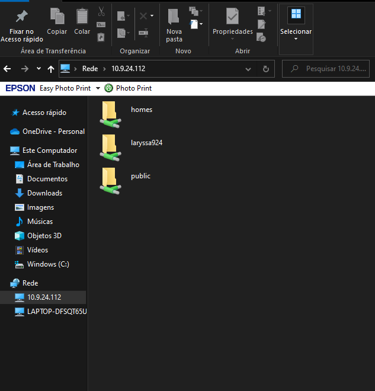

# Compartilhamento de arquivos com Samba

## Objetivo:
      
      * Configurar um servidor compartilhamento de arquivos usando o serviço Samba no linux
```
Tabela: Definições da rede interna
--------------------------------
|  DESCRICAO  |  IP            |
--------------------------------
| rede        | 10.9.24.112    |
| máscara     | 255.255.255.0  |
| Gateway     | 10.9.24.1      |
| Samba-SRV   | 10.9.24.112    |
| NameServer1 | 10.9.24.112    |
| NameServer2 | 10.9.24.106    |
--------------------------------
```      
## Passo a passo:
  
  1. Definir o IP da rede interna para o Samba-SRV
  
```bash
$ sudo nano /etc/netplan/00-installer-config.yaml
```

```
network:
    ethernets:
        ens160:
            dhcp4: false 
            addresses: [10.9.24.112/24]
            gateway4: 10.9.24.1
            nameservers:
                addresses:
                   - 8.8.8.8
                   - 8.8.4.4
                search: []
        ens192:
            addresses: [192.168.0.89/29]
    version: 2
```
```bash
$ sudo netplan apply
$ ifconfig -a
$ ping 10.9.24.1
```
  
  2. Nome da VM  
  
  * Verificar o nome da VM a partir do código abaixo: 
  
```bash
$ hostnamectl status
```

  * renomear o nome atual para  samba <nomedaequipe_turma>.labredes.ifalarapiraca.local

```bash
$ sudo hostnamectl set-hostname nomedesejado
```

```
Exemplo: $ sudo hostnamectl set-hostname samba.Emanuelly-Laryssa_924.labredes.ifalarapiraca.local
```
 
  3. Verificar os processos:
  
```bash
$ netstat -an | grep LISTEN

tcp        0      0 127.0.0.53:53           0.0.0.0:*               LISTEN
tcp        0      0 0.0.0.0:22              0.0.0.0:*               LISTEN
```

OBS: A primeira linha indica que há um processo na porta 53, o qual indica o serviço de resolução local. A segunda indica que tem um processo rodando na porta 22, que, nesse caso, é o SSH instalado.

   4. Acesso remoto/login via ssh (Use Putty no Windows ou o Terminal no Linux)
  
  ```bash
  $ ssh administrador@10.9.24.112
  ```
  
  5. Instalação do SAMBA
  
```bash
$ sudo apt update
$ sudo apt install samba

```
  
   6. Verificar se o samba está rodando

```bash
$ sudo systemctl status smbd
```

```
smbd.service - Samba SMB Daemon
     Loaded: loaded (/lib/systemd/system/smbd.service; enabl>
     Active: active (running) since Thu 2021-12-16 00:00:30 >
       Docs: man:smbd(8)
             man:samba(7)
             man:smb.conf(5)
   Main PID: 3519870 (smbd)
     Status: "smbd: ready to serve connections..."
      Tasks: 4 (limit: 1063)
     Memory: 8.9M
     CGroup: /system.slice/smbd.service
             ├─3519870 /usr/sbin/smbd --foreground --no-proc>
             ├─3519872 /usr/sbin/smbd --foreground --no-proc>
             ├─3519873 /usr/sbin/smbd --foreground --no-proc>
             └─3519875 /usr/sbin/smbd --foreground --no-proc>
```

```bash
$ netstat -an | grep LISTEN

tcp        0      0 0.0.0.0:139             0.0.0.0:*               LISTEN
tcp        0      0 127.0.0.53:53           0.0.0.0:*               LISTEN
tcp        0      0 0.0.0.0:22              0.0.0.0:*               LISTEN
tcp        0      0 0.0.0.0:445             0.0.0.0:*               LISTEN
tcp6       0      0 :::139                  :::*                    LISTEN
tcp6       0      0 :::22                   :::*                    LISTEN
tcp6       0      0 :::445                  :::*             

```

OBS: agora foram ativadas as portas 139 e 445 carregadas em interfaces genéricas.

  7. Fazer backup do arquivo de configuração do samba e criar um arquivo novo somente com os comandos necessários.

```bash
$ cd /etc/samba/
$ ls -la 
```

```
drwxr-xr-x  3 root root 4096 Dec 16 00:00 .
drwxr-xr-x 95 root root 4096 Dec 16 00:00 ..
-rw-r--r--  1 root root    8 May 27  2021 gdbcommands
-rw-r--r--  1 root root 8942 Dec 16 00:00 smb.conf
drwxr-xr-x  2 root root 4096 May 27  2021 tls
```

```bash
$ cat smb.conf
```

```# Sample configuration file for the Samba suite for Debian GNU/Linux.
#
#
# This is the main Samba configuration file. You should read the
# smb.conf(5) manual page in order to understand the options listed
# here. Samba has a huge number of configurable options most of which
# are not shown in this example
#
# Some options that are often worth tuning have been included as
# commented-out examples in this file.
#  - When such options are commented with ";", the proposed setting
#    differs from the default Samba behaviour
#  - When commented with "#", the proposed setting is the default
#    behaviour of Samba but the option is considered important
#    enough to be mentioned here
#
# NOTE: Whenever you modify this file you should run the command
# "testparm" to check that you have not made any basic syntactic
# errors.


#======================= Global Settings =======================


[global]


## Browsing/Identification ###


# Change this to the workgroup/NT-domain name your Samba server will part of
   workgroup = WORKGROUP


# server string is the equivalent of the NT Description field
   server string = %h server (Samba, Ubuntu)


#### Networking ####


# The specific set of interfaces / networks to bind to
# This can be either the interface name or an IP address/netmask;
# interface names are normally preferred
;   interfaces = 127.0.0.0/8 eth0


# Only bind to the named interfaces and/or networks; you must use the
# 'interfaces' option above to use this.
# It is recommended that you enable this feature if your Samba machine is
# not protected by a firewall or is a firewall itself.  However, this
# option cannot handle dynamic or non-broadcast interfaces correctly.
;   bind interfaces only = yes


#### Debugging/Accounting ####


# This tells Samba to use a separate log file for each machine
# that connects
   log file = /var/log/samba/log.%m


# Cap the size of the individual log files (in KiB).
   max log size = 1000


# We want Samba to only log to /var/log/samba/log.{smbd,nmbd}.
# Append syslog@1 if you want important messages to be sent to syslog too.
   logging = file


# Do something sensible when Samba crashes: mail the admin a backtrace
   panic action = /usr/share/samba/panic-action %d


####### Authentication #######


# Server role. Defines in which mode Samba will operate. Possible
# values are "standalone server", "member server", "classic primary
# domain controller", "classic backup domain controller", "active
# directory domain controller".
#
# Most people will want "standalone server" or "member server".
# Running as "active directory domain controller" will require first
# running "samba-tool domain provision" to wipe databases and create a
# new domain.
   server role = standalone server


   obey pam restrictions = yes


# This boolean parameter controls whether Samba attempts to sync the Unix
# password with the SMB password when the encrypted SMB password in the
# passdb is changed.
   unix password sync = yes


# For Unix password sync to work on a Debian GNU/Linux system, the following
# parameters must be set (thanks to Ian Kahan <<kahan@informatik.tu-muenchen.de> for
# sending the correct chat script for the passwd program in Debian Sarge).
   passwd program = /usr/bin/passwd %u
   passwd chat = *Enter\snew\s*\spassword:* %n\n *Retype\snew\s*\spassword:* %n\n *password\supdated\ssuccessfully* .


# This boolean controls whether PAM will be used for password changes
# when requested by an SMB client instead of the program listed in
# 'passwd program'. The default is 'no'.
   pam password change = yes


# This option controls how unsuccessful authentication attempts are mapped
# to anonymous connections
   map to guest = bad user


########## Domains ###########


#
# The following settings only takes effect if 'server role = primary
# classic domain controller', 'server role = backup domain controller'
# or 'domain logons' is set
#


# It specifies the location of the user's
# profile directory from the client point of view) The following
# required a [profiles] share to be setup on the samba server (see
# below)
;   logon path = \\%N\profiles\%U
# Another common choice is storing the profile in the user's home directory
# (this is Samba's default)
#   logon path = \\%N\%U\profile


# The following setting only takes effect if 'domain logons' is set
# It specifies the location of a user's home directory (from the client
# point of view)
;   logon drive = H:
#   logon home = \\%N\%U


# The following setting only takes effect if 'domain logons' is set
# It specifies the script to run during logon. The script must be stored
# in the [netlogon] share
# NOTE: Must be store in 'DOS' file format convention
;   logon script = logon.cmd


# This allows Unix users to be created on the domain controller via the SAMR
# RPC pipe.  The example command creates a user account with a disabled Unix
# password; please adapt to your needs
; add user script = /usr/sbin/adduser --quiet --disabled-password --gec os "" %u


# This allows machine accounts to be created on the domain controller via the
# SAMR RPC pipe.
# The following assumes a "machines" group exists on the system
; add machine script  = /usr/sbin/useradd -g machines -c "%u machine account" -d /var/lib/samba -s /bin/false %u


# This allows Unix groups to be created on the domain controller via the SAMR
# RPC pipe.
; add group script = /usr/sbin/addgroup --force-badname %g


############ Misc ############


# Using the following line enables you to customise your configuration
# on a per machine basis. The %m gets replaced with the netbios name
# of the machine that is connecting
;   include = /home/samba/etc/smb.conf.%m


# Some defaults for winbind (make sure you're not using the ranges
# for something else.)
;   idmap config * :              backend = tdb
;   idmap config * :              range   = 3000-7999
;   idmap config YOURDOMAINHERE : backend = tdb
;   idmap config YOURDOMAINHERE : range   = 100000-999999
;   template shell = /bin/bash


# Setup usershare options to enable non-root users to share folders
# with the net usershare command.


# Maximum number of usershare. 0 means that usershare is disabled.
#   usershare max shares = 100


# Allow users who've been granted usershare privileges to create
# public shares, not just authenticated ones
   usershare allow guests = yes


#======================= Share Definitions =======================


# Un-comment the following (and tweak the other settings below to suit)
# to enable the default home directory shares. This will share each
# user's home directory as \\server\username
;[homes]
;   comment = Home Directories
;   browseable = no


# By default, the home directories are exported read-only. Change the
# next parameter to 'no' if you want to be able to write to them.
;   read only = yes


# File creation mask is set to 0700 for security reasons. If you want to
# create files with group=rw permissions, set next parameter to 0775.
;   create mask = 0700


# Directory creation mask is set to 0700 for security reasons. If you want to
# create dirs. with group=rw permissions, set next parameter to 0775.
;   directory mask = 0700


# By default, \\server\username shares can be connected to by anyone
# with access to the samba server.
# Un-comment the following parameter to make sure that only "username"
# can connect to \\server\username
# This might need tweaking when using external authentication schemes
;   valid users = %S


# Un-comment the following and create the netlogon directory for Domain Logons
# (you need to configure Samba to act as a domain controller too.)
;[netlogon]
;   comment = Network Logon Service
;   path = /home/samba/netlogon
;   guest ok = yes
;   read only = yes


# Un-comment the following and create the profiles directory to store
# users profiles (see the "logon path" option above)
# (you need to configure Samba to act as a domain controller too.)
# The path below should be writable by all users so that their
# profile directory may be created the first time they log on
;[profiles]
;   comment = Users profiles
;   path = /home/samba/profiles
;   guest ok = no
;   browseable = no
;   create mask = 0600
;   directory mask = 0700


[printers]
   comment = All Printers
   browseable = no
   path = /var/spool/samba
   printable = yes
   guest ok = no
   read only = yes
   create mask = 0700


# Windows clients look for this share name as a source of downloadable
# printer drivers
[print$]
   comment = Printer Drivers
   path = /var/lib/samba/printers
   browseable = yes
   read only = yes
   guest ok = no
# Uncomment to allow remote administration of Windows print drivers.
# You may need to replace 'lpadmin' with the name of the group your
# admin users are members of.
# Please note that you also need to set appropriate Unix permissions
# to the drivers directory for these users to have write rights in it
;   write list = root, @lpadmin
```

```bash
$ ls -la
$ sudo cp /etc/samba/smb.conf{,.backup}
$ ls -la 
```

```
drwxr-xr-x  3 root root 4096 Dec 16 00:33 .
drwxr-xr-x 95 root root 4096 Dec 16 00:00 ..
-rw-r--r--  1 root root    8 May 27  2021 gdbcommands
-rw-r--r--  1 root root 8942 Dec 16 00:00 smb.conf
-rw-r--r--  1 root root 8942 Dec 16 00:33 smb.conf.backup
drwxr-xr-x  2 root root 4096 May 27  2021 tls
```
  
```bash
$ sudo bash -c 'grep -v -E "^#|^;" /etc/samba/smb.conf.backup | grep . > /etc/samba/smb.conf'
```
OBS: o comando acima é reponsável pela retirada de todos os comentários

```bash
cat smb.conf
```

```
[global]
   workgroup = WORKGROUP
   server string = %h server (Samba, Ubuntu)
   log file = /var/log/samba/log.%m
   max log size = 1000
   logging = file
   panic action = /usr/share/samba/panic-action %d
   server role = standalone server
   obey pam restrictions = yes
   unix password sync = yes
   passwd program = /usr/bin/passwd %u
   passwd chat = *Enter\snew\s*\spassword:* %n\n *Retype\snew\s*\spassword:* %n\n *password\supdated\ssuccessfully* .
   pam password change = yes
   map to guest = bad user
   usershare allow guests = yes
[printers]
   comment = All Printers
   browseable = no
   path = /var/spool/samba
   printable = yes
   guest ok = no
   read only = yes
   create mask = 0700
[print$]
   comment = Printer Drivers
   path = /var/lib/samba/printers
   browseable = yes
   read only = yes
   guest ok = no
```
   8. Editar o arquivo de configuração /etc/samba/smb.conf

```bash
$ sudo nano /etc/samba/smb.conf
```

OBS: se já estiver em /etc/samba/ o comando é sudo nano smb.conf


```bash
 [global]
    workgroup = WORKGROUP
   `netbios name = samba-srv
    security = user`
    server string = %h server (Samba, Ubuntu)
   `interfaces = 127.0.0.1/8 ens160 ens192
    bind interfaces only = yes`
    log file = /var/log/samba/log.%m
    max log size = 1000
    logging = file
    panic action = /usr/share/samba/panic-action %d
    server role = standalone server
    obey pam restrictions = yes
    unix password sync = yes
    passwd program = /usr/bin/passwd %u
    passwd chat = *Enter\snew\s*\spassword:* %n\n *Retype\snew\s*\spassword:* %n\n *password\supdated\ssuccessfully* .
    pam password change = yes
    map to guest = bad user
    usershare allow guests = yes
 [printers]
    comment = All Printers
    browseable = no
    path = /var/spool/samba
    printable = yes
    guest ok = no
    read only = yes
    create mask = 0700
 [print$]
    comment = Printer Drivers
    path = /var/lib/samba/printers
    browseable = yes
    read only = yes
    guest ok = no  
`[homes]
    comment = Home Directories
    browseable = yes
    read only = no
    create mask = 0700
    directory mask = 0700
    valid users = %S
[public]
    comment = public anonymous access
    path = /samba/public
    browsable =yes
    create mask = 0660
    directory mask = 0771
    writable = yes
    guest ok = yes
    guest only = yes
    force user = nobody
    force create mode = 0777
    force directory mode = 0777
```

OBS: Adicionar aquilo que está em destaque e, em relação as interfaces da máquina,  na linha "interfaces = 127.0.0.1/8 ens160 ens192" adicionaá-las separando-as os nomes por espaços.

```
● Reniciar o serviço smbd
``` 

```bash
$ sudo systemctl restart smbd
```

```
● Verificar as interfaces instaladas que as portas 139 e 445 estão rodando. 
```

```bash
$ netstat -an | grep LISTEN

tcp        0      0 127.0.0.1:139           0.0.0.0:*               LISTEN
tcp        0      0 10.9.24.112:139         0.0.0.0:*               LISTEN
tcp        0      0 192.168.0.89:139        0.0.0.0:*               LISTEN
tcp        0      0 127.0.0.53:53           0.0.0.0:*               LISTEN
tcp        0      0 0.0.0.0:22              0.0.0.0:*               LISTEN
tcp        0      0 127.0.0.1:445           0.0.0.0:*               LISTEN
tcp        0      0 10.9.24.112:445         0.0.0.0:*               LISTEN
tcp        0      0 192.168.0.89:445        0.0.0.0:*               LISTEN
```

   9. Criar um usuário do S.O para que possa utilizar o compartilhamento samba:

```
● * O Samba já está instalado, agora precisamos criar um diretório para compartilhá-lo em rede.
```

```bash
$ sudo mkdir -p /samba/public
```

```
● Configurar as permissões para que qualquer um possa acessar o compartilhamento público.
```

```bash
$ sudo chown -R nobody:nogroup /samba/public
$ sudo chmod -R 0777 /samba/public
$ sudo chgrp sambashare /samba/public
```

```
● Reiniciar o serviço
```

```bash
$ sudo systemctl restart smbd
```

```
● Criar um usuário para que possa utilizar o compartilhamento samba:

* usuário: aluno924
* senha: alunoifa
```

```bash
$ sudo adduser aluno924
```

```
Adding user `laryssa924' ...
Adding new group `laryssa924' (1003) ...
Adding new user `laryssa924' (1003) with group `laryssa924' ...
Creating home directory `/home/laryssa924' ...
Copying files from `/etc/skel' ...
New password:
Retype new password:
passwd: password updated successfully
Changing the user information for laryssa924
Enter the new value, or press ENTER for the default
        Full Name []: Aluna de SRED do IFAL Arapiraca
        Room Number []: 924
        Work Phone []:
        Home Phone []:
        Other []:
Is the information correct? [Y/n] Y
```

```
● Verificar se foi adicionado
```

```bash
$ getent passwd

laryssa924:x:1003:1003:Aluna de SRED do IFAL Arapiraca,924,,:/home/laryssa924:/bin/bash
```

```
● É necessário vincular o usuário do S.O. ao Serviço Samba. Repita a senha do laryssa924 ou crie uma senha nova somente para acessar o compartilhamento de arquivo. Neste caso repetiremos a senha do usuário laryssa924.
```

```bash
$ sudo smbpasswd -a laryssa924

New SMB password:
Retype new SMB password:
Added user laryssa924.
```

```bash
$ sudo usermod -aG sambashare laryssa924

sambashare:x:118:laryssa924
```

   10. Cliente do compartilhamento

```
* Em um máquina com Windows (também pode usar linux os MacOS) digite no Winndows Explorer o endereço IP do servidor samba da seguinte forma:
**\\ip_do_maquina**. Exemplo: \\10.9.24.112
```


<p><center> Figura 1: Tela do Windows Explorer com o acesso ao recurso compartilhado.</center></p>   
    


